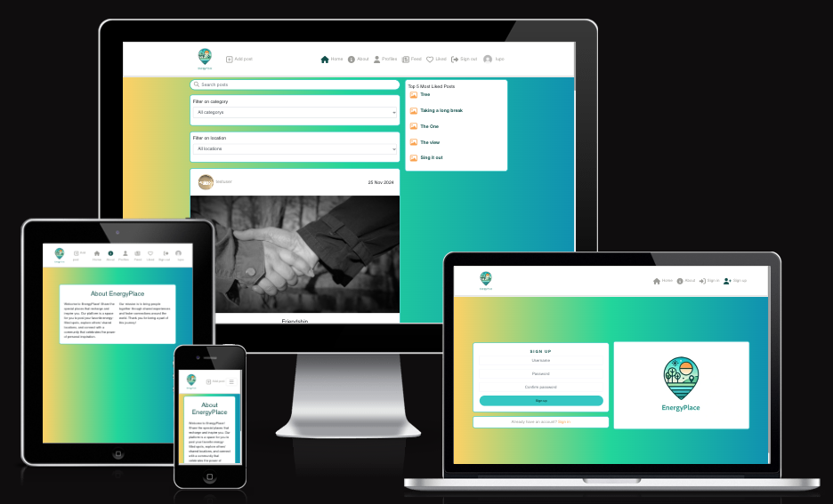
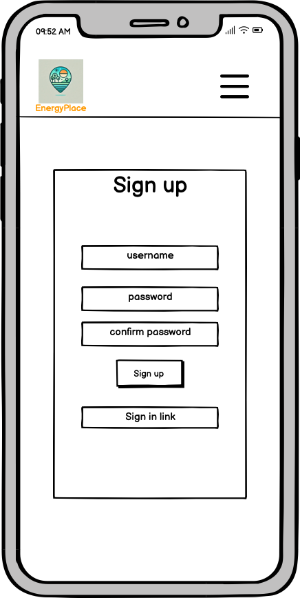
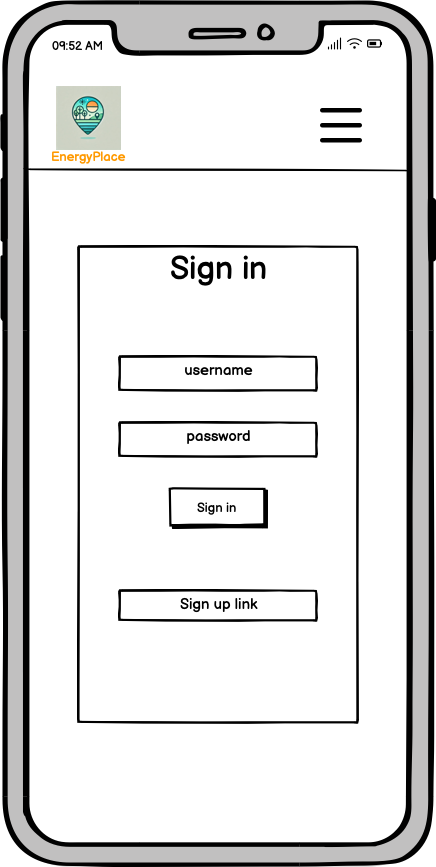
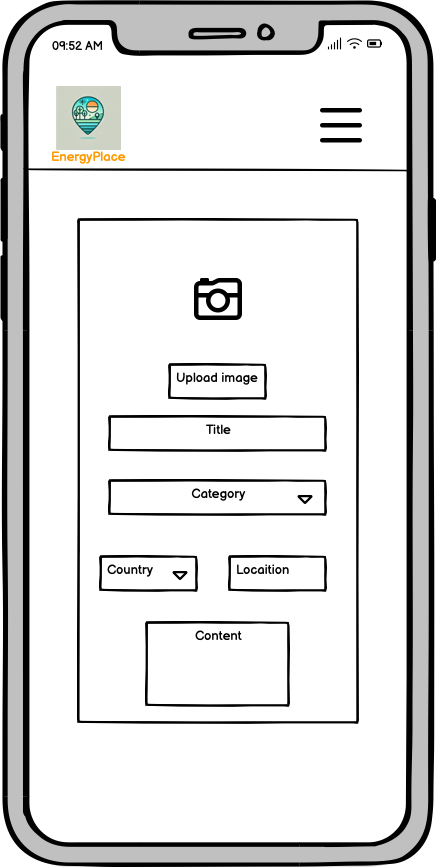
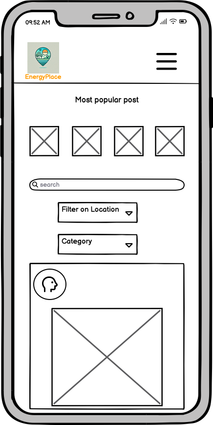
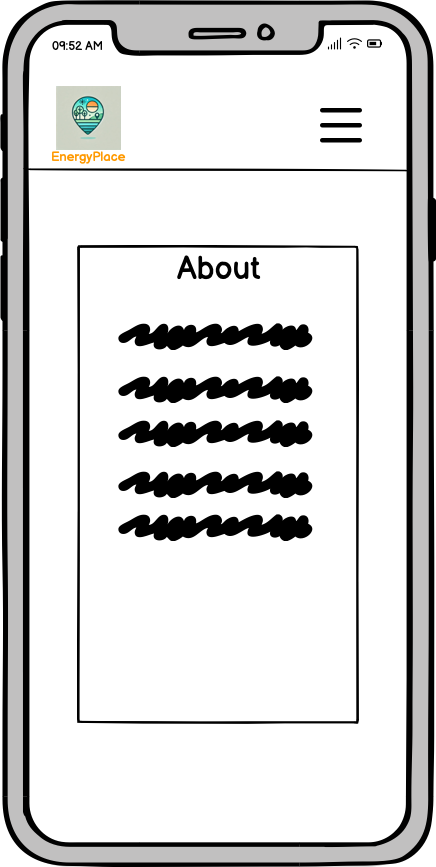
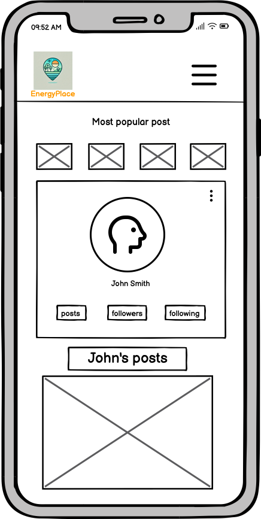
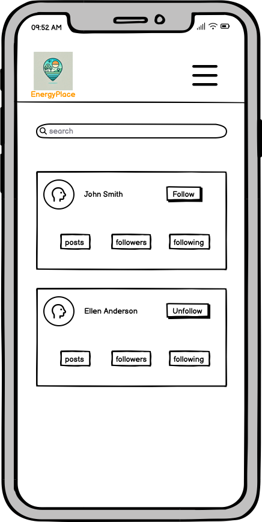
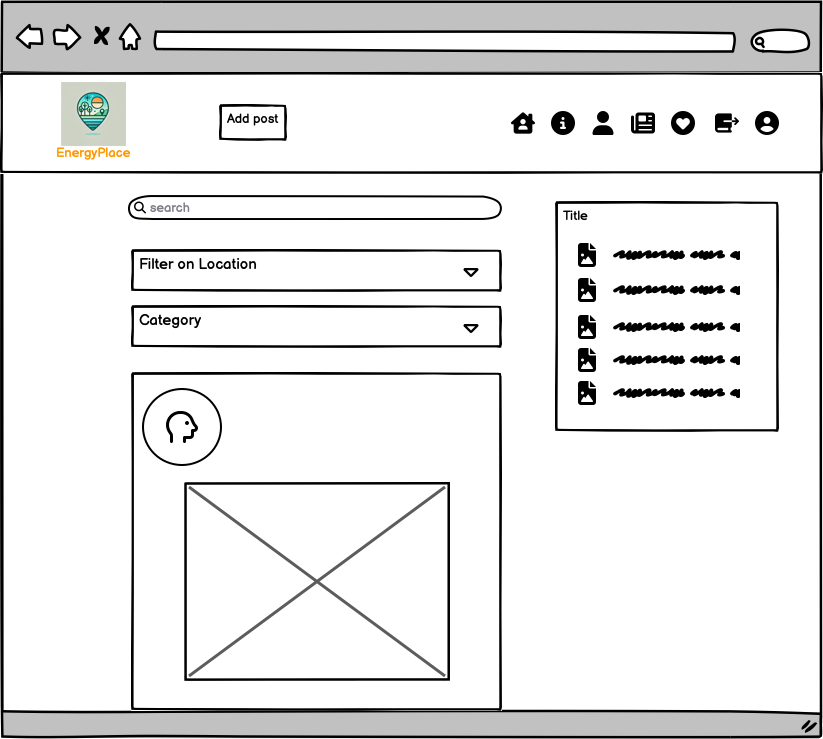
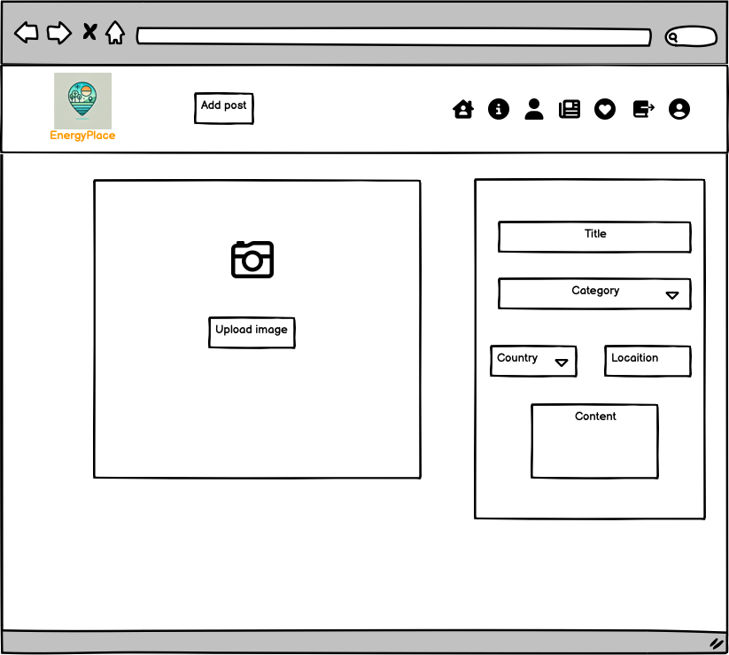

# EnergyPlace

EnergyPlace is a social platform designed to connect people through shared experiences and a passion for discovering inspiring places.  It provides a space to share your favorite energy-boosting locations, whether it's a tranquil nature spot, an exciting sporting venue, a vibrant music scene, a comforting café, or any place that recharges your spirit.

EnergyPlace is built using React for the frontend and Django REST Framework for the backend, ensuring a modern, scalable, and responsive user experience.

View the live [EnergyPlace](https://energyplace-fe-44789d1db942.herokuapp.com/)
 application.

View [API backend](https://github.com/Malinchristina/EnergyPlace-API)

 

## Table of Contents

- [EnergyPlace](#energyplace)
- [User Experience (UX)](#user-experience-ux)
    - [Design Thinking](#design-thinking)
        - [Mobile First](#mobile-first)
        - [Logo](#logo)
        - [Colors](#colors)
        - [Typography](#typography)
    - [Project Planning](#project-planning)
      - [Wireframes](#wireframes)
        - [Sign Up Page](#wireframe-sign-up-page)
        - [Sign In Page](#wireframe-sign-in-page)
        - [Add Post (Mobile)](#wireframe-add-post-mobile)
        - [Home Feed & Likes](#wireframe-home-feed-likes)
        - [About Page](#wireframe-about-page)
        - [Profile Page](#wireframe-profile-page)
        - [Profiles Page](#wireframe-profiles-page)
        - [Large Screen Layout](#wireframe-large-screen-layout)
        - [Add Post (Large Screen)](#wireframe-add-post-large-screen)
- [Features](#features)
  - [Home](#home)
  - [About](#about)
  - [Profiles](#profile-pages)
  - [Profile Editing](#profile-editing)
  - [Feed](#feed)
  - [Liked](#liking)
  - [Authentication](#authentication)
  - [Post Creation](#post-creation)
  - [Post Detail](#post-detail)
  - [Post Editing](#post-editing)
  - [Commenting](#commenting)
  - [404 (Not Found)](#not-found)
  - [Future Feature](#future-feature)
- [Agile Methodologies](#agile-methodologies)
- [Technologies Used](#technologies-used)
  - [Languages](#languages)
  - [Frameworks](#frameworks)
  - [Libraries](#libraries)
- [Testing](#testing)
- [Deployment](#deployment)
  - [GitHub](#github)
  - [Heroku](#heroku)
- [Credits](#credits)
  - [Tools and Programs](#tools-and-programs)
  - [Inspiration](#inspiration)
  - [How to](#how-to)
  - [Acknowledgments](#acknowledgements)

## User Experience (UX)

### Design Thinking

The goal of the design was to create a playful and energetic aesthetic that reflects the spirit of discovery and connection, central to the EnergyPlace concept. The gradient background adds vibrancy to the interface, while the design emphasizes simplicity and usability.

  
Key Features

  - **Intuitive Navigation:** The navigation bar at the top provides easy access to key sections like Home, Profiles, About, and Liked Posts, ensuring users can effortlessly explore the platform.
  - **Search and Filters:** Users can quickly search posts by keywords or find posts based on specific categories or locations using the dropdown filters.
  - **Top 5 Most Liked Posts:** A dedicated sidebar showcases the top 5 most liked posts, encouraging engagement and inspiration.
  - **Content Display:** Posts are presented in a clean, card-based layout, with clear details such as the post title, author, category, location, and content.

 

The overall design ensures an engaging user experience, making it easy for users to discover and interact with inspiring locations and content.

### Mobile First

EnergyPlace was designed with a mobile-first approach, ensuring optimal user experience on smaller screens.

- **Collapsible Top 5 Component:**  
  To conserve screen space, the "Top 5 Most Liked Posts" component is collapsible on mobile devices. This allows users to toggle its visibility, providing easy access while keeping the interface uncluttered.

- **Right-Aligned Navigation Menu:**  
  The navigation bar opens to the right, aligning with the user’s current position when interacting with the app on mobile. This decision prioritizes convenience and accessibility for one-handed use.

This approach ensures that the app remains visually appealing and functional across all device sizes, particularly on mobile where space is limited.

### Logo  

The logo for EnergyPlace was created with the assistance of AI, with text and background refinements made by a friend. The design aims to reflect the essence of EnergyPlace, conveying its mission to inspire and energize users through shared locations.  

The logo is prominently featured in the main interface and is also integrated into the design of the sign-in and sign-up pages, ensuring a cohesive and welcoming brand identity across the platform.

### Colors  

The color scheme for the project was inspired by the logo. Colors were selected using [Image Color Picker](https://imagecolorpicker.com/) and then refined into a cohesive palette using [Coolors](https://coolors.co/). This palette was applied consistently throughout the project to maintain a unified and visually appealing design.

### Typography  

The typography used in the project is the [Roboto](https://fonts.google.com/specimen/Roboto) font. It was chosen for its clean and modern look, ensuring readability and a professional appearance across the application.

## Project planning

### Wireframes

[Balsamiq](https://balsamiq.com/) was used to create the initial design for the app. A mobile-first approach was implemented, and the designs for larger screens were adapted based on the mobile layout.

  
Wireframe: Sign Up Page

  

  
Wireframe: Sign In Page

  

  
Wireframe: Add Post (Mobile)

  

  
Wireframe: Home Feed & Likes

  

  
Wireframe: About Page

  

  
Wireframe: Profile Page

  

  
Wireframe: Profiles Page

  

 

The primary difference in the layout for larger screens is the positioning of the "Top 5 Popular Posts" section. On larger screens, this section appears on the right-hand side of the screen, whereas on mobile screens, it is displayed above the posts for better accessibility and usability.

  
Wireframe: Large Screen Layout

  

 

On larger screens, the Add Post page layout adjusts to make optimal use of the available space. The section containing the title, location, and content fields is placed on the right-hand side of the screen, while the image upload and preview area remains on the left.

  
Wireframe: Add Post (Large Screen)

  

## Features

  
Home

  The `/` route serves as the main landing page of the application.  
  - **Users can:**
    - Search for posts by title or keywords using the `SearchBar` component.
    - Filter posts by category and location using the `FilterDropdown` components.
  - **Features:**
    - Infinite scrolling for a seamless user experience.
    - Posts are displayed in a card format, including title, content, author, and category.

  
About

  The `/about` route displays information about the EnergyPlace application and its purpose through the `About.js` component.  

  
Profile Pages

  Each user has a dedicated profile page via the `ProfilePage` component.  
  - **Features:**
    - Displays the user's:
      - Name and bio.
      - Profile image.
      - Post count, followers count, and following count via the `ProfileStats` component.
    - Provides functionality for logged-in users to:
      - Follow or unfollow other users with live updates through backend API calls.

  
Profile Editing

  Users can edit their profile details via the `ProfileEditForm` component.  
  - **Features:**
    - Allows modification of:
      - Name and bio.
      - Profile image via an upload feature.
    - Users can also:
      - Change their password via the `UserPasswordForm`.
      - Update their username via the `UsernameForm`.

  
Feed

  The `/feed` page displays posts from users that the current user follows.  
  - **Users can:**
    - View posts specifically from their followed users.
    - Interact with posts through likes, comments, and shares.
  - **Features:**
    - A personalized feed tailored to the user's connections.
    - Infinite scrolling for continuous content viewing.

  
Liked

  Users can like or unlike posts.  
  - **Features:**
    - Updates the post's like count dynamically.
    - Integrates seamlessly with backend API calls to reflect the like status.

  
Authentication

  Secure user authentication is handled through dedicated components.  
  - **Features:**
    - **SignUpForm**: Allows users to register.
    - **SignInForm**: Allows users to log in securely.
    - **NavBar**: Provides a logout button and links to other sections of the app.

  
Post Creation

  Users can create new posts through the `PostCreateForm` component.  
  - **Features:**
    - Input fields for:
      - Title and content.
      - Image upload.
      - Category selection from predefined options.
      - Location details, including country and locality.
    - Validates all required fields before submission.

  
Post Detail

  The `PostPage` component displays individual posts in detail.  
  - **Features:**
    - Displays:
      - Title, content, image, location, and category.
      - Author details (with a link to their profile).
      - Date and like/comment counts.
    - Allows users to:
      - Like or unlike posts.
      - Add, edit, or delete comments.
    - Includes the `Comment` component for managing user discussions.

  
Post Editing

  Authenticated users can edit their own posts through the `PostEditForm` component.  
  - **Features:**
    - Mirrors the post creation functionality, allowing users to:
      - Update the title, content, image, category, and location details.

  
Commenting

  Users can participate in discussions using the `CommentCreateForm` component.  
  - **Features:**
    - Add new comments to posts.
    - Edit or delete their own comments through the `CommentEditForm` component.

  
404 (Not Found)

  A custom `NotFound` component displays a user-friendly message when users navigate to an invalid route.  

  
Future Feature

In the future, the profile page could include the following features:
- **Followers List**: A list showing all the users who follow your profile.
- **Following List**: A list showing all the users that you are following.

These features will allow users to easily see their connections within the app, improving the social experience.

### Agile Methodologies

An Agile workflow, managed using a [Kanban board](https://github.com/users/Malinchristina/projects/6), guided this project's iterative development. While [MoSCoW prioritization](https://en.wikipedia.org/wiki/MoSCoW_method) wasn't formally tracked on the Kanban board itself, this method was applied mentally throughout the user story development and task assignment process, with the following categorization:

- **Must have:** User authentication, Post creation, Post display.
- **Should have:** Commenting functionality, Liking functionality.
- **Could have:** Advanced search filters, User profiles.
- **Won't have (in this iteration):** Notifications, Map integration, FollowersList

Larger features were structured as epics, further decomposed into individual user stories for effective task management and progress tracking.

## Technologies Used

The EnergyPlace frontend uses the following technologies, chosen for their performance, and ease of use:

### Languages

- **JavaScript (ES6+):**  Provides core functionality with modern features for improved code readability and efficiency.
- **HTML:**  Forms the structural foundation of the web pages using semantic HTML5.
- **CSS (with CSS Modules):**  Handles styling and layout with a modular approach for maintainability.

### Frameworks

- **React:** A component-based architecture for building UIs, offering performance and scalability.
- **React Router:** Manages client-side routing for smooth navigation.
- **React Bootstrap:** Leverages pre-built Bootstrap components for a consistent, responsive UI.

### Libraries

- **Axios:**  Simplifies API calls to the backend.
- **jwt-decode:** Decodes JWTs for secure authentication.
- **react-infinite-scroll-component:**  Implements infinite scrolling for enhanced user experience.

## Testing

Find the test file [here](TESTING.md)

## Deployment

### GitHub
The repository was created and stored on GitHub. Any changes made in VS Code was done with the commands.

* git add .
* git commit -m "Commit message"
* git push

### Heroku Deployment

#### Steps to Deploy:

1. Log in to Heroku 
   
2. Create a New App

   Create a new app in Heroku and give it a unique name.

3. Set Up Buildpacks

   Navigate to the "Settings" tab and add the required buildpack:
   - Add `heroku/nodejs` as the buildpack to handle the React application.

4. Connect to GitHub 

   In the "Deploy" tab, connect the Heroku app to your GitHub repository.

## Credits

### Tools and Programs

- Visual Studio Code (VS Code) - primary code editor.
- [ChatGPT](https://chatgpt.com/) for logo.
- [Phind](https://www.phind.com/) helped locate relevant resources (e.g., GeeksforGeeks, Stack Overflow) for efficient problem-solving.
- [Coolors](https://coolors.co/) - color palette generation.
- [Color Picker](https://imagecolorpicker.com/)
- [FontAwesome](https://fontawesome.com/) icons were used throughout the application for various UI elements.
- [Favicon](https://favicon.io/) was used to create the favicon for the app.

### Inspiration

- Most inspiration comes from Code Institutes Moments walkthrough project.

### How to

- [React](https://17.reactjs.org/)
- [React Bootstrap](https://react-bootstrap-v4.netlify.app/getting-started/introduction/)
- Net Ninjas [full react tutorial](https://www.youtube.com/playlist?list=PL4cUxeGkcC9gZD-Tvwfod2gaISzfRiP9d)
- The project involved extensive research, trial and error, and reading resources from websites such as [W3schools](https://www.w3schools.com/), [MDN webdocs](https://developer.mozilla.org/en-US/), [Geeks for Geeks](https://www.geeksforgeeks.org/) and [Stack Overflow](https://stackoverflow.com/).

### Acknowledgements
- My mentor Gareth McGirr for support and guidance.
- Thanks to the swedish community in Slack for support and testing.
- Gradient background color with help from alumni Jennifer Hujanen.
- My dear friend Lina Myhr who helped with logo fixes.